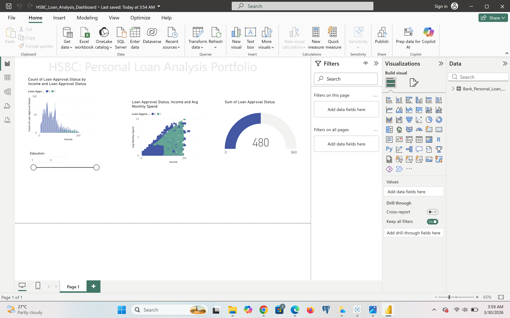
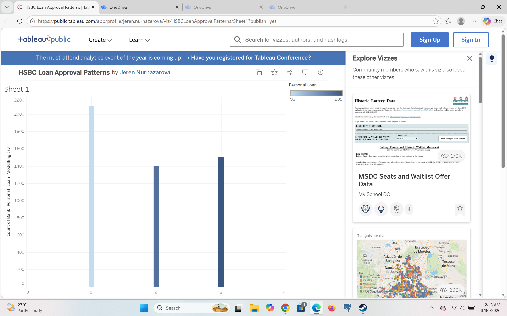

# HSBC Personal Loan Acceptance Analysis 🏦📈

## Project Overview
This project focuses on identifying the key drivers for personal loan approvals using a dataset of 5,000 bank customers. The goal was to build an interactive dashboard in **Power BI** to help credit officers make data-driven decisions based on customer demographics and financial behavior.

## Key Insights
* **Income Factor:** High-income segments show a significantly higher loan acceptance rate.
* **Education Impact:** Advanced professional degrees correlate positively with creditworthiness.
* **Spending Patterns:** Monthly credit card spend (CCAvg) serves as a strong secondary predictor for loan interest.

## Visualizations Included
* **Gauge Chart:** Total number of approved loans (Current count: 480).
* **Bar Chart:** Loan acceptance distribution by Income and Education levels.
* **Scatter Plot:** Correlation between Annual Income and Monthly Credit Card Spending.
* **Slicers:** Interactive filtering by Education category.

## Dashboard Preview
Below is the final interactive dashboard developed in Power BI, showcasing key insights from the HSBC loan dataset:

---
### Final Note
This project demonstrates proficiency in banking data processing, SQL querying, and creating interactive financial reporting using Power BI.

---
### Final Note
Проект демонстрирует навыки обработки банковских данных и создания интерактивной отчетности в Power BI.
---
*Developed as part of a Finance & Data Analytics portfolio.*

## Tableau Data Visualization
Analyzed customer demographics and education levels to predict loan acceptance. 
[View Interactive Dashboard](https://public.tableau.com/app/profile/jeren.nurnazarova/viz/HSBCLoanApprovalPatterns/Sheet1)

