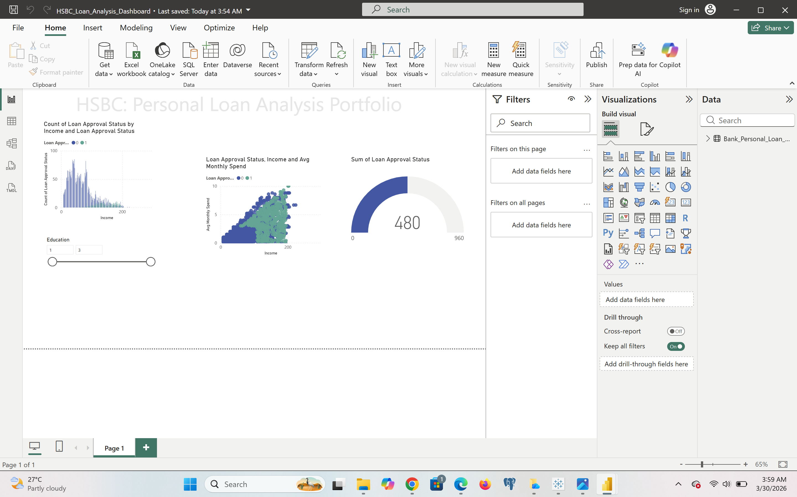
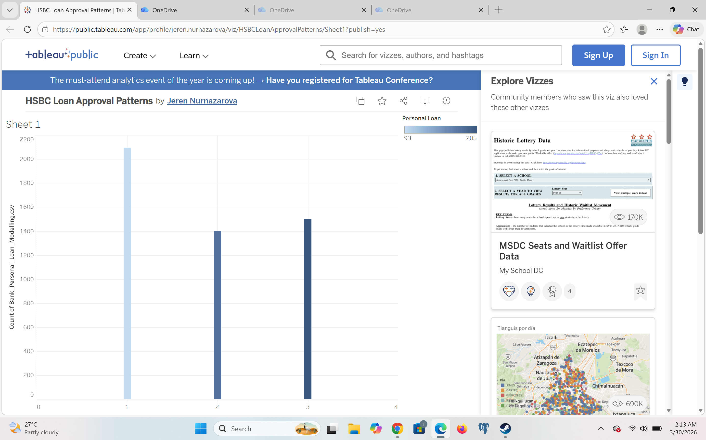

# Personal Loan Risk Analysis Portfolio 🏦📈

**Note:** This project uses a public/practice dataset styled on personal loan data. 
It is not affiliated with, sponsored by, or completed on behalf of HSBC.

**Dataset source:** [Bank Personal Loan Modelling — Kaggle](https://www.kaggle.com/datasets/itsmesunil/bank-loan-modelling)

## Project Overview
This project focuses on identifying the key drivers for personal loan approvals 
using a dataset of 5,000 bank customers. The goal was to build an interactive 
dashboard in Power BI to help credit officers make data-driven decisions based 
on customer demographics and financial behavior.

## Data Cleaning
- Verified no missing/null values across all 14 fields
- Checked for and removed duplicate customer IDs
- Reviewed Income and CCAvg for outliers using descriptive statistics before modelling

## Methodology: Baseline vs. Window-Function Risk Tiering
Compared a flat income threshold (predicting approval if income exceeded the 
overall median) against a window-function-based approach ranking applicants by 
income *within* their education tier. The grouped, window-function approach 
improved precision from ~19.5% to ~35.5% — a ~16-point gain — showing that risk 
should be evaluated relative to peer groups, not the population as a whole. 
Full SQL in `risk_tier_analysis.sql`.

## Key Insights
- Income Factor: High-income segments show a significantly higher loan acceptance rate.
- Education Impact: Advanced professional degrees correlate positively with creditworthiness.
- Spending Patterns: Monthly credit card spend (CCAvg) serves as a strong secondary predictor for loan interest.

## Visualizations Included
- Gauge Chart: Total number of approved loans (Current count: 480).
- Bar Chart: Loan acceptance distribution by Income and Education levels.
- Scatter Plot: Correlation between Annual Income and Monthly Credit Card Spending.
- Slicers: Interactive filtering by Education category.

## Dashboard Preview

## Related Work
Additional SQL queries for banking, risk, and e-commerce analysis are in my 
[sql-portfolio](https://github.com/jerennurnazarova0912/sql-portfolio) repo.

## Tableau Data Visualization
Analyzed customer demographics and education levels to predict loan acceptance. 

[View Interactive Dashboard](https://public.tableau.com/app/profile/jeren.nurnazarova/viz/HSBCLoanApprovalPatterns/Sheet1?publish=yes)

---
Developed as part of a self-directed Finance & Data Analytics portfolio.
